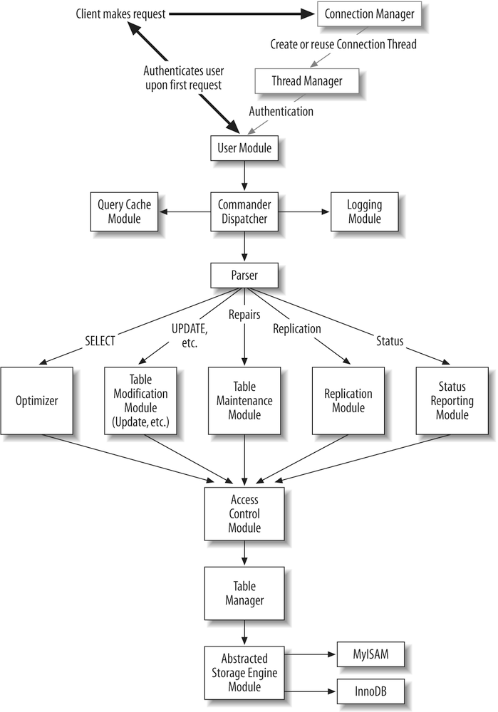

## Resources

### Done
- https://github.com/yangtau/example-engine/tree/master
- https://github.com/takatoshiono/mysql-mycsv/tree/master
- https://github.com/aboev/smalldb/blob/master/ha_smalldb.cc
- https://pmem.io/blog/2015/06/implementing-simple-mysql-storage-engine-with-libpmemobj/
- https://github.com/laysakura/mysql-YetAnotherSkeletonEngine/blob/master/src/ha_skeleton.cc

## Concepts

### Overall Flow

