## Concepts

### Purge Thread

```text

+---------------------------------------------+
|      InnoDB Server Initialization Phase     |
|   (after crash or DDL recovery is complete) |
+---------------------------------------------+
| srv_start()                                 |
|   └── ddl_recovery()                        |
|       └── complete_recovery()               |
|           └── srv_start_thread_after_ddl_recovery()  ← [YOU ARE HERE] 
|                 ├── start page cleaner      |
|                 ├── start purge thread      |
|                 └── start background tasks  |
+---------------------------------------------+
                          |
                          v
+--------------------------------+
| srv_start_purge_thread()       |  ← Starts the purge thread
+--------------------------------+
           |
           v
+------------------------------------+
| purge_coordinator_thread()         |  ← Main loop that drives purge
|   └── trx_purge()                  |  ← Purges old undo logs / history
|       └── trx_purge_run()         |
|           └── trx_purge_truncate_undo_logs()
+------------------------------------+

```

### Operations


#### Checkpoint

3 Types
- Sharp checkpoint
- Fuzzy checkpoint
- Adaptive flushing

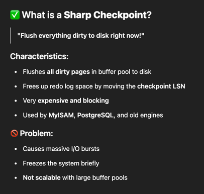

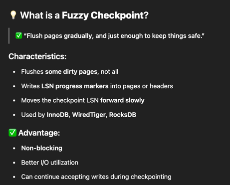

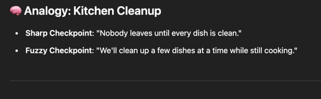

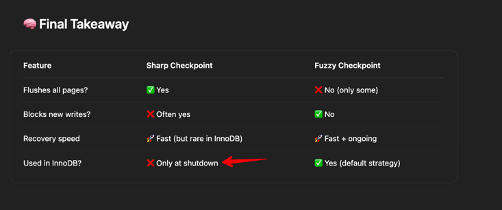

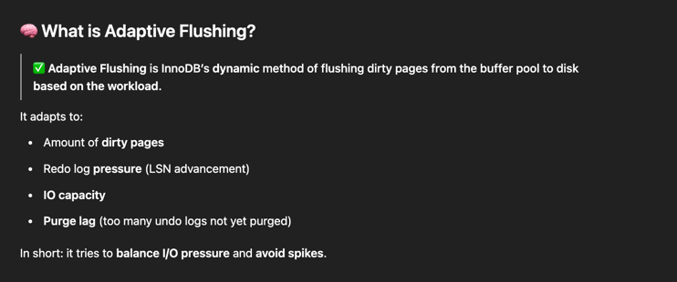

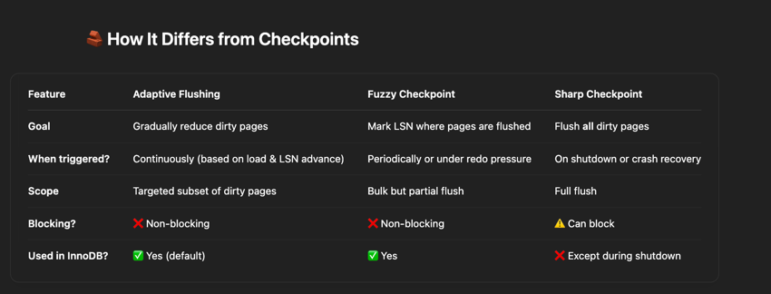

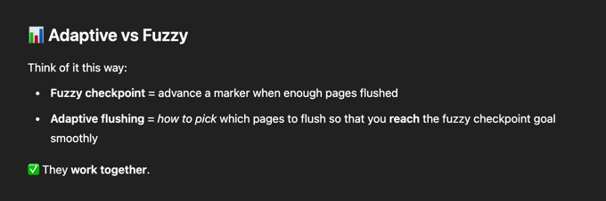

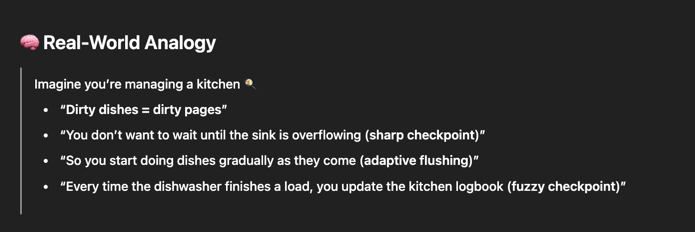

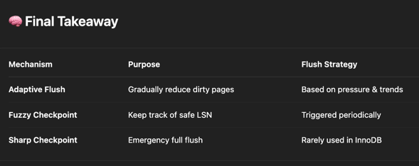

#### Purge

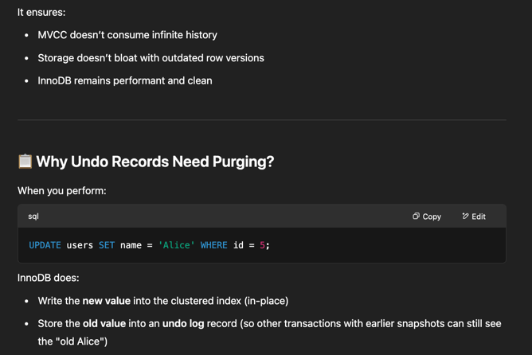

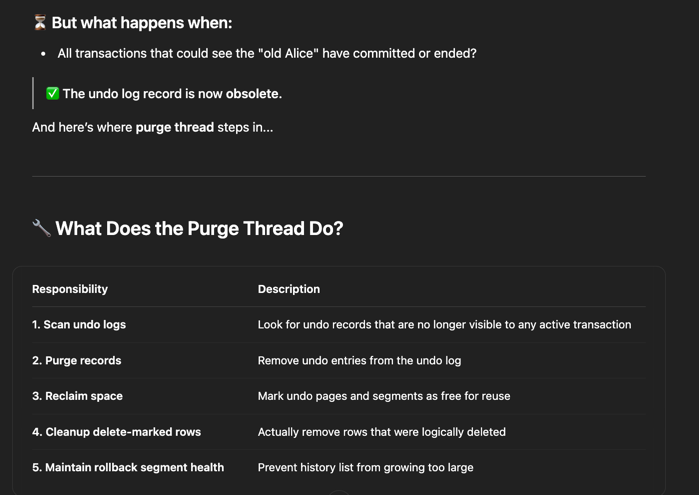

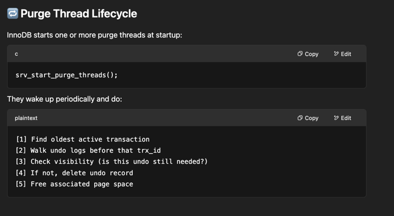

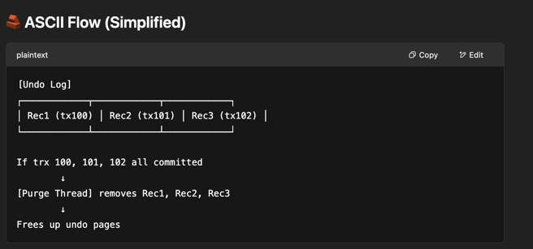