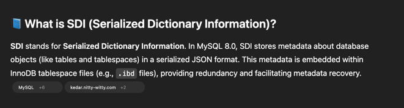
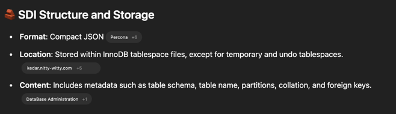
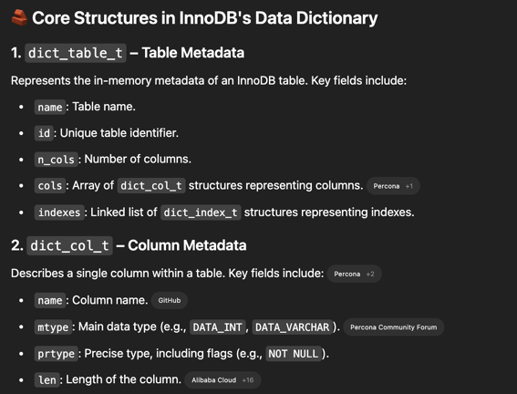
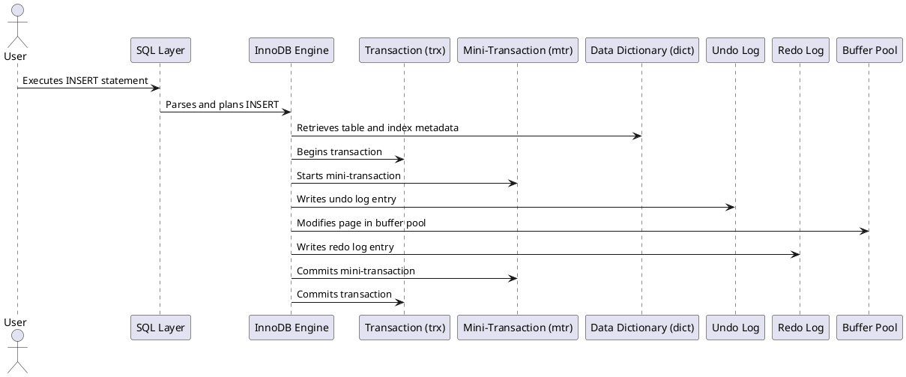

## Concepts

### SDI





```text
+-------------------------+
|     InnoDB Tablespace   |
|         (.ibd file)     |
+-------------------------+
|                         |
|  +-------------------+  |
|  |   Table Data      |  |
|  +-------------------+  |
|                         |
|  +-------------------+  |
|  |   Index Data      |  |
|  +-------------------+  |
|                         |
|  +-------------------+  |
|  |   SDI (JSON)      |  | <-- Serialized metadata
|  +-------------------+  |
+-------------------------+

+-------------------------+
|   InnoDB Data Dictionary|
|     (System Tables)     |
+-------------------------+
|                         |
|  +-------------------+  |
|  |   Tables Metadata |  |
|  +-------------------+  |
|                         |
|  +-------------------+  |
|  |   Indexes Metadata|  |
|  +-------------------+  |
+-------------------------+


```


### Sample Code

```cpp

class Table_impl : public Abstract_table_impl, virtual public Table {
  Object_id m_se_private_id;
  String_type m_engine;
  String_type m_comment;
  enum_partition_type m_partition_type;
  String_type m_partition_expression;
  Index_collection m_indexes;
  Foreign_key_collection m_foreign_keys;
  Partition_collection m_partitions;
  Trigger_collection m_triggers;
  Check_constraint_collection m_check_constraints;
};


class Column_impl : public Entity_object_impl, public Column {
  enum_column_types m_type;
  bool m_is_nullable;
  bool m_is_auto_increment;
  String_type m_default_value;
};


class Index_impl : public Entity_object_impl, public Index {
  enum_index_type m_type;
  bool m_is_unique;
  Column_collection m_columns;
};

```



### Interaction




### Constraints

- Unique Key Constraints: `n_uniq /*!<number of fields from the begining which are enough to determine an index entry uniquely*/` 
- Foreign Key Constraints