## Resources

### Todo
- [ ] https://blog.csdn.net/weixin_35500243/article/details/113277478
- [ ] https://zhuanlan.zhihu.com/p/40208895
- [ ] https://www.racecoder.com/archives/1070/


## Concepts

### Txn Flow


### Locks

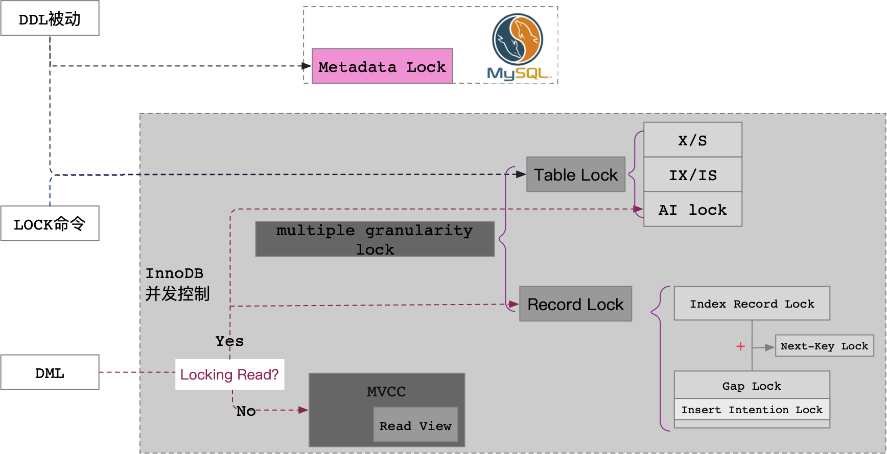

### Flow


### Undo Log
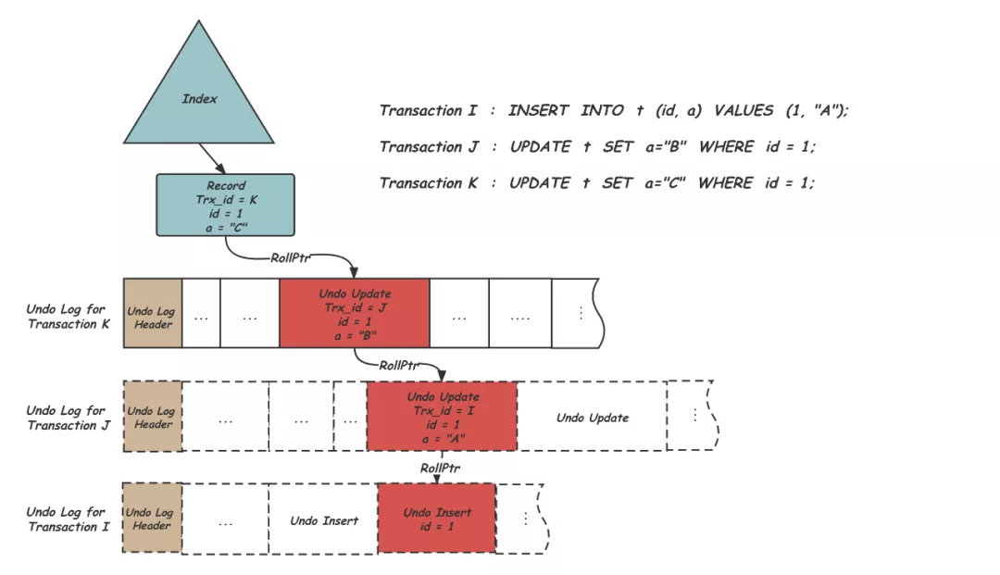

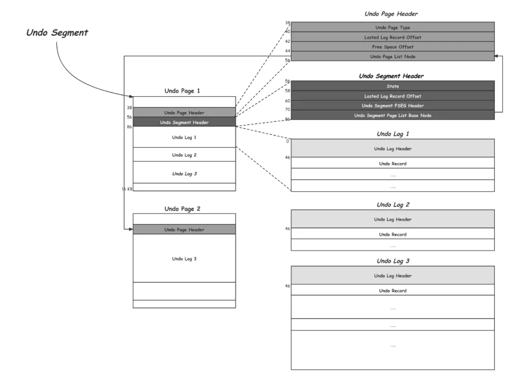

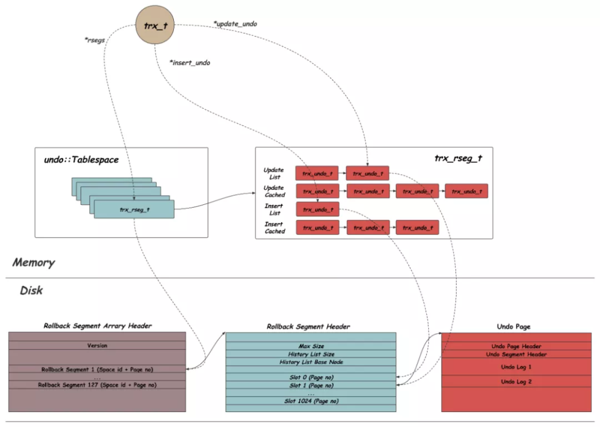

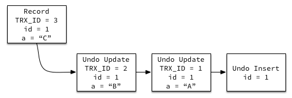

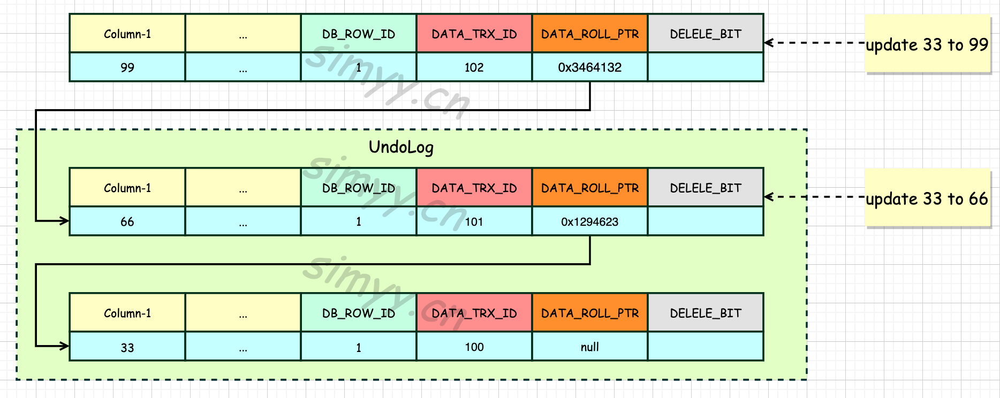

### Group Commit (Mostly Dist Txn)

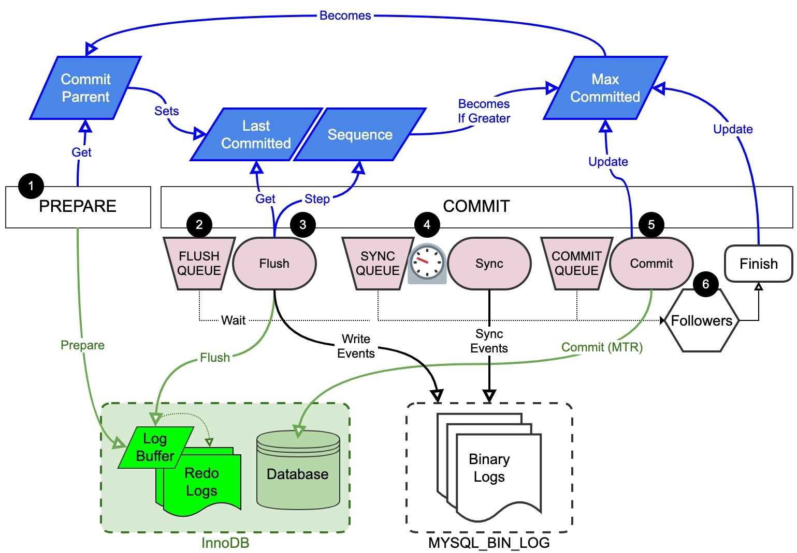


### tc_log

It is not part of ha_xxx. It is part of xa.cc
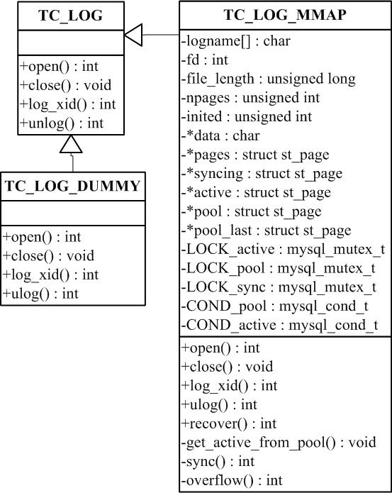

### trx_sys

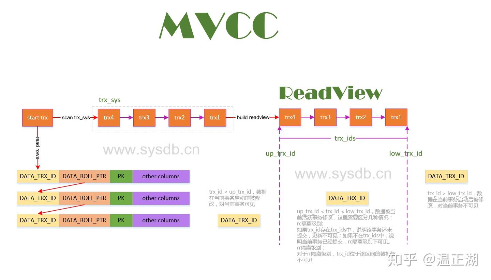

```text
Central place that maintains all the txn lists.
However, it doesn't do conflict detection. It is done when row locks are acquired.


Why is trx_sys critical?
- It enables MVCC (Multi-Version Concurrency Control) by managing snapshots and read views
- It allows the purge thread to clean undo logs only when no active transaction needs them
- It keeps transactions isolated while coordinating their lifecycle (start, commit, rollback)
- It supports crash recovery by tracking undo log metadata


It acts as the central coordinator for:
All active transactions
- Undo logs
- Purge operations
- Rollback segments
- Access to concurrency-related structures
```


### Replication

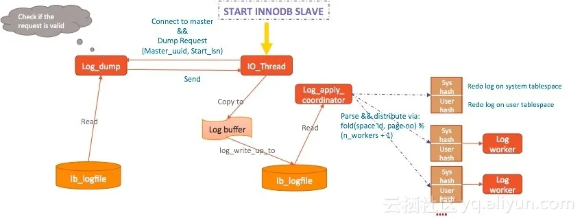


### Txn Sys RSegs

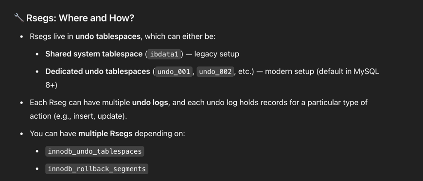

```C++
  /** This is a wrapper for a std::vector of trx_rseg_t object pointers. */
  class Rsegs {

      /** beginning iterator
      @return an iterator to the first element */
      Rseg_Iterator begin() { return (m_rsegs.begin()); }
    
      /** ending iterator
      @return an iterator to the end */
      Rseg_Iterator end() { return (m_rsegs.end()); }
      
      /** Add rollback segment.
      @param[in]    rseg    rollback segment to add. */
      void push_back(trx_rseg_t *rseg) { m_rsegs.push_back(rseg); }
    
    
     /** Find the rseg at the given slot in this vector.
      @param[in]    slot    a slot within the vector.
      @return an iterator to the end */
      trx_rseg_t *at(ulint slot) { return (m_rsegs.at(slot)); }
      
      /** std::vector of rollback segments */
      Rsegs_Vector m_rsegs;
  }
```


```c++
/** The rollback segment memory object */
struct trx_rseg_t {

  /** Enter the rseg->mutex. */
  void latch() {
    mutex_enter(&mutex);
    ut_ad(validate_curr_size(false));
  }

  /** Exit the rseg->mutex. */
  void unlatch() {
    ut_ad(validate_curr_size(false));
    mutex_exit(&mutex);
  }
  
  
    /** Increment the current size of the rollback segment by the given number
  of pages. */
  void incr_curr_size() { ++curr_size; }
  
   /** mutex protecting the fields in this struct except id,space,page_no
  which are constant */
  RsegMutex mutex;

  /** space ID where the rollback segment header is placed */
  space_id_t space_id{};

  /** page number of the rollback segment header */
  page_no_t page_no{};

  /** page size of the relevant tablespace */
  page_size_t page_size;

  /** maximum allowed size in pages */
  page_no_t max_size{};
};

```