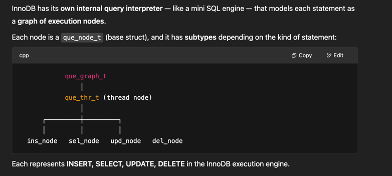
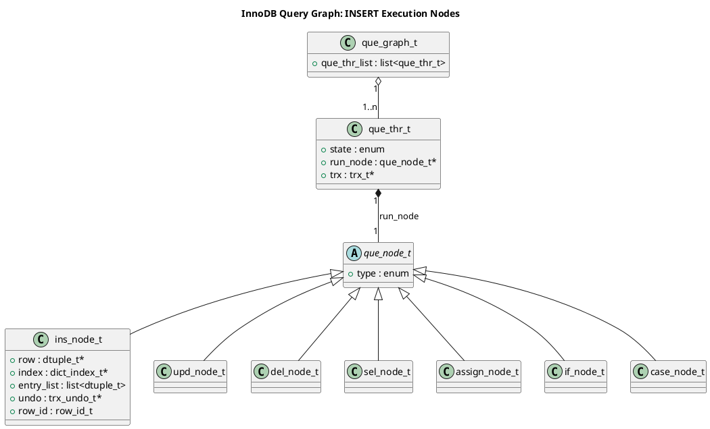
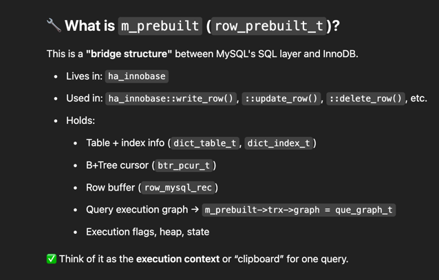
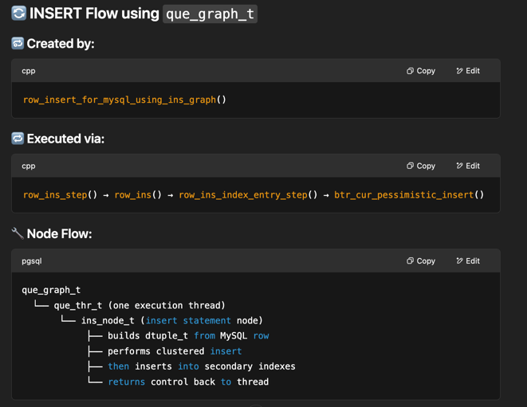
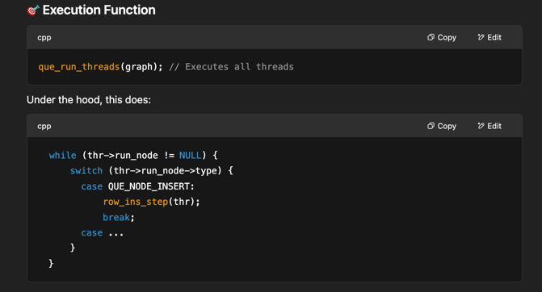
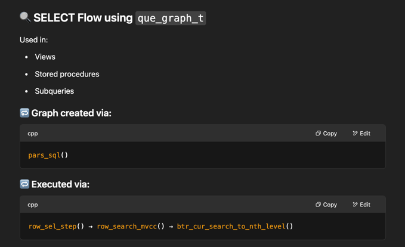
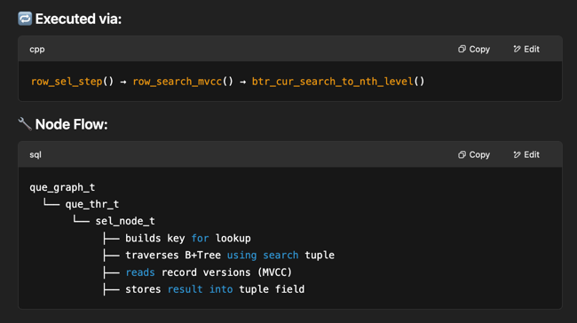

## Concepts





```text
                     ┌──────────────────────┐
                     │   que_graph_t        │
                     │  (Query Graph Root)  │
                     └────────┬─────────────┘
                              │
                    ┌────────▼────────┐
                    │   que_thr_t     │
                    │  (Execution     │
                    │   Thread)       │
                    └────────┬────────┘
                             │ run_node
                             ▼
                  ┌──────────────────────┐
                  │     ins_node_t       │
                  │   (Insert Node)      │
                  └──────────────────────┘
                             │
         ┌───────────────────┴─────────────────────┐
         ▼                                          ▼
   row = dtuple_t                           index = dict_index_t
         │                                          │
         ▼                                          ▼
  [1, 'hello']                          PRIMARY or SECONDARY index
         │                                          │
         ▼                                          ▼
     undo log                           entry_list: built from row

```

```text
ha_innobase
 └── m_prebuilt : row_prebuilt_t
       ├── row_mysql_rec   ← MySQL row buffer
       ├── index/table     ← from dict layer
       ├── pcur            ← B+Tree cursor
       ├── trx             ← pointer to trx_t
       │     └── graph     ← points to que_graph_t
       │            └── que_thr_t
       │                   └── ins_node_t
       └── ins_node        ← direct pointer to current INSERT node

```



```text
                     ┌──────────────────────┐
                     │     que_graph_t      │
                     └────────┬─────────────┘
                              │
                    ┌────────▼────────┐
                    │    que_thr_t    │
                    │ (thread state)  │
                    └────────┬────────┘
                             │
              ┌──────────────┼──────────────┐
              ▼                             ▼
         INSERT path                  SELECT path
        ┌────────────┐             ┌────────────┐
        │ ins_node_t │             │ sel_node_t │
        └────┬───────┘             └────┬───────┘
             │                            │
   ┌─────────▼─────────┐        ┌─────────▼────────────┐
   │ Build dtuple_t    │        │ Build search tuple   │
   │ from m_prebuilt   │        │ from WHERE clause     │
   └────────┬──────────┘        └────────┬──────────────┘
            ▼                            ▼
   ┌──────────────┐             ┌─────────────────────────┐
   │ btr_cur_pess │             │ row_search_mvcc()       │
   │ insert into  │             │ + MVCC visibility check │
   │ clustered idx│             └──────────┬──────────────┘
   └──────┬───────┘                        ▼
          ▼                      ┌──────────────────────┐
  ┌───────────────┐             │ store into result row │
  │ insert into    │             └──────────────────────┘
  │ secondary idxs │
  └────────────────┘

```

```text
SQL INSERT Statement
        │
        ▼
ha_innobase::write_row()
        │
        ▼
row_prebuilt_t (m_prebuilt)
        │
        ▼
que_graph_t
        │
        ▼
que_thr_t
        │
        ▼
ins_node_t
        │
        ▼
row_ins_step()
        │
        ▼
row_ins()
        │
        ▼
row_ins_index_entry_step()
        │
        ▼
row_ins_clust_index_entry_low()
        │
        ▼
btr_cur_pessimistic_insert()

```

### Insert flow





### Query flow



