## Concepts

### TODO
- [ ] https://www.mydbops.com/blog/innodb-physical-files-on-mysql-80
- [ ] https://breachdirectory.com/blog/innodb-from-the-inside-ibdata1-and-the-log-files/


### Table Space

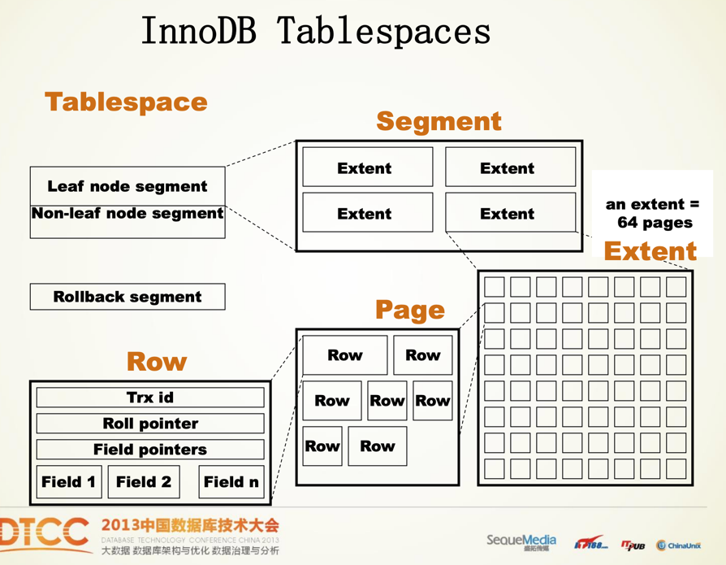

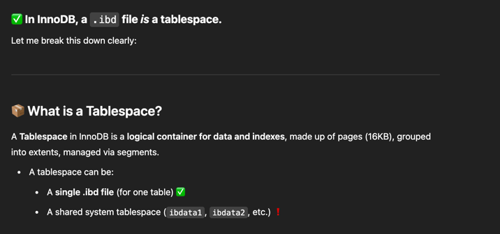

### Segment

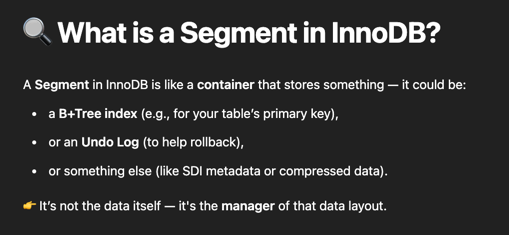

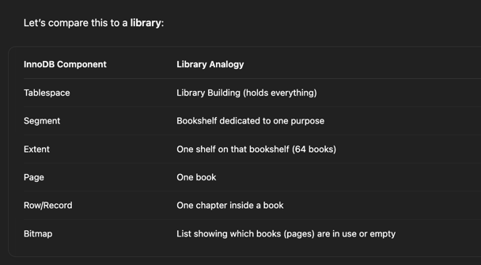


### Tablespace etc Class defenition
```c++
class Row {
public:
    uint64_t trx_id;             // Last modifying transaction ID
    uint64_t roll_ptr;           // Undo log pointer
    std::vector<Field> fields;   // Field data
};

class Page {
public:
    uint32_t page_no;            // Page number in tablespace
    std::vector<Row> rows;       // Records stored in the page
};

class Extent {
public:
    static const int PAGE_COUNT = 64;
    std::array<Page, PAGE_COUNT> pages; // 64 contiguous pages
};

class SegmentInode {
public:
    uint64_t seg_id;             // Segment ID
    std::vector<Extent*> extents; // Extents owned by this segment
};

class Segment {
public:
    SegmentInode* inode;         // Tracks allocated extents
};

class Tablespace {
public:
    std::string name;
    std::vector<Segment> segments; // One segment per index/tree
    std::vector<Extent> free_extents; // Extents not yet assigned
};

```

Original Code

```c++
class Tablespace {
public:
    uint32_t space_id;           // Unique identifier for the tablespace
    uint32_t size;               // Size of the tablespace in pages
    uint32_t free_limit;         // Page number up to which pages have been initialized
    List<SegmentInode> segment_inodes; // List of segment inodes
    List<ExtentDescriptor> free_extents; // List of free extents
    // ... other metadata fields
};

//--------------------
class SegmentInode {
public:
    uint64_t segment_id;         // Unique identifier for the segment
    List<ExtentDescriptor> full_extents; // Extents fully used by the segment
    List<ExtentDescriptor> free_extents; // Extents with free pages
    List<ExtentDescriptor> free_frag_extents; // Extents partially used
    // ... other metadata fields
};
class ExtentDescriptor {
public:
    uint64_t segment_id;         // ID of the owning segment
    uint8_t state;               // State of the extent (e.g., free, full, fragment)
    Bitset<2 * 64> page_bitmap;  // Bitmap indicating the usage of each page
    // ... other metadata fields
};

//--------------------

class Page {
public:
    uint32_t page_number;        // Page number within the tablespace
    PageHeader header;           // Metadata about the page
    std::vector<Row> rows;       // Records stored in the page
    PageTrailer trailer;         // Checksum and other trailer info
};
class Row {
public:
    uint64_t trx_id;             // Transaction ID of the last modification
    uint64_t roll_ptr;           // Pointer to the undo log record
    std::vector<Field> fields;   // User-defined fields
};


```


### Segments can be BTree or Undo Log etc.

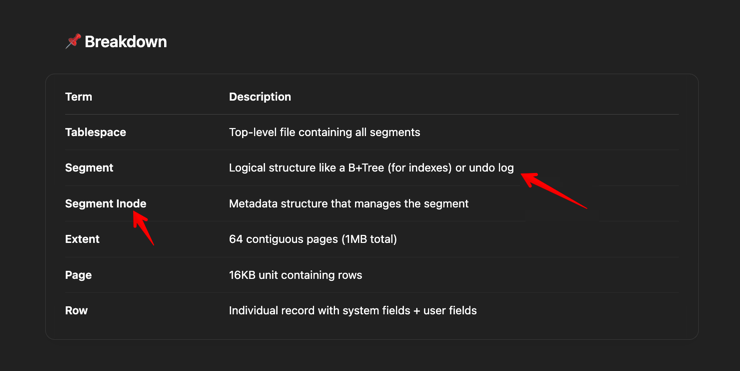

Note: Extend and Chunk(allocated by Buffer Pool) are same conceptually.

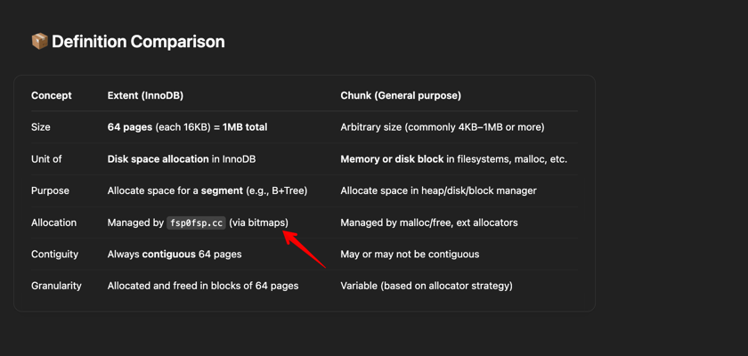

### ibd file layout

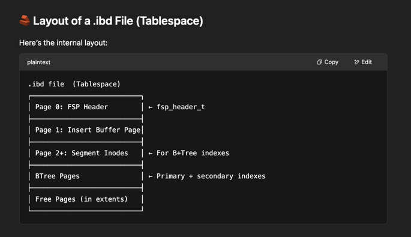

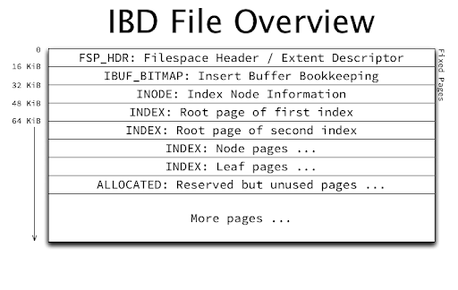


### Other Files in MySQL data directory

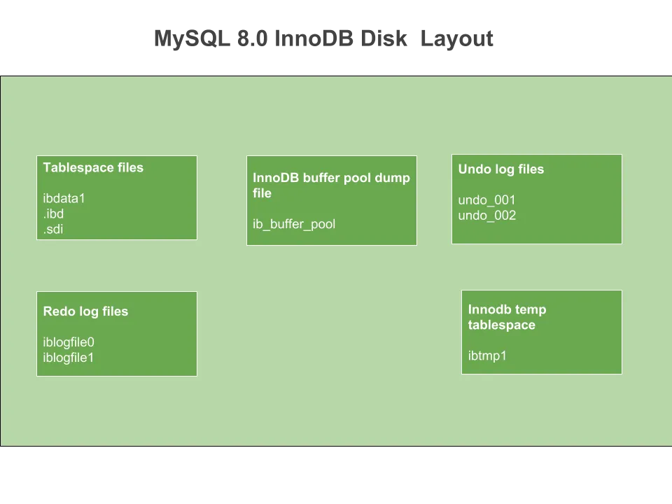


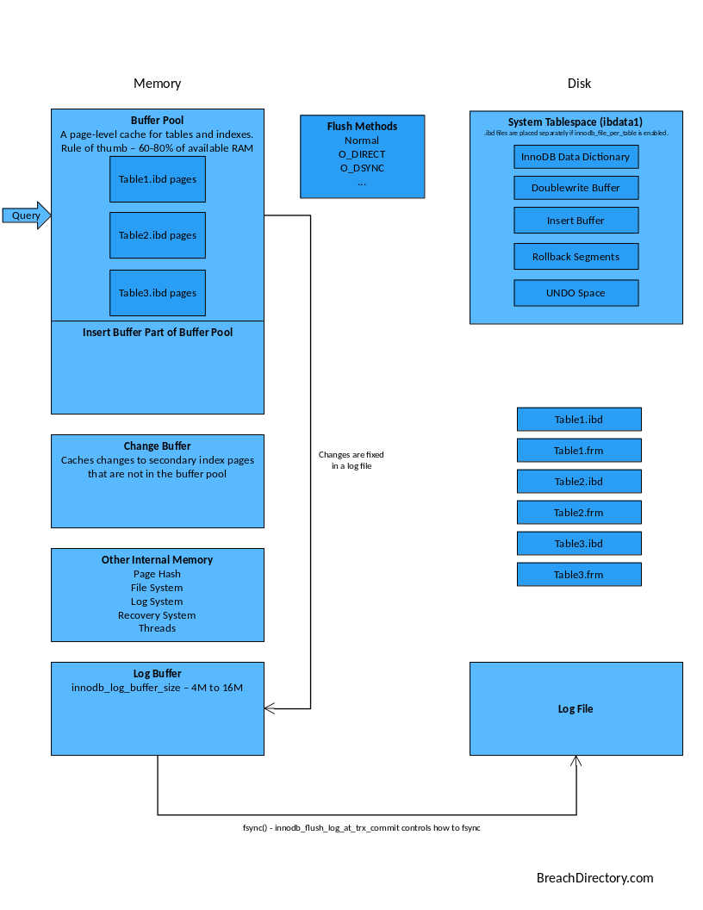

### What is FSeg?

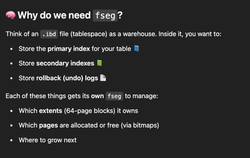

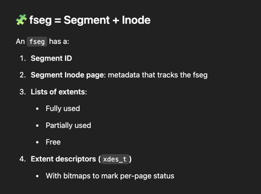

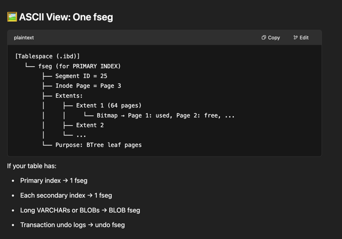

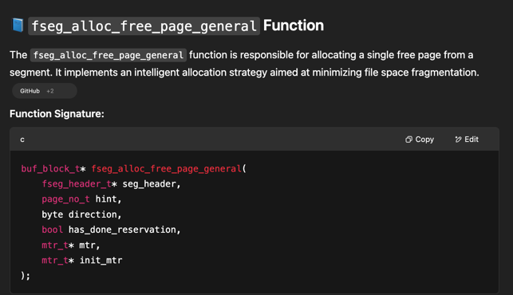