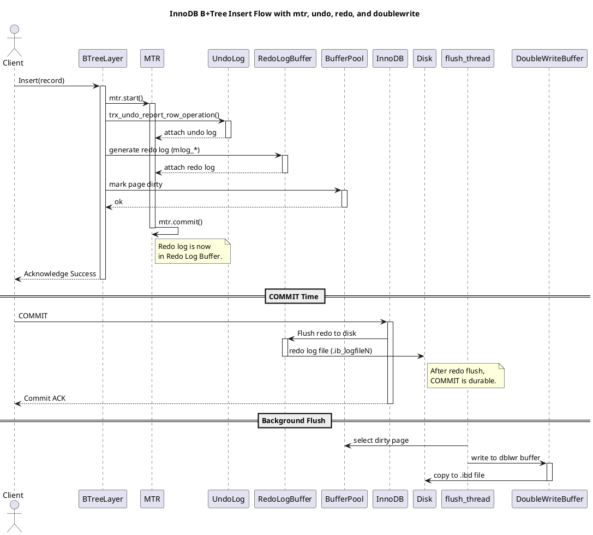
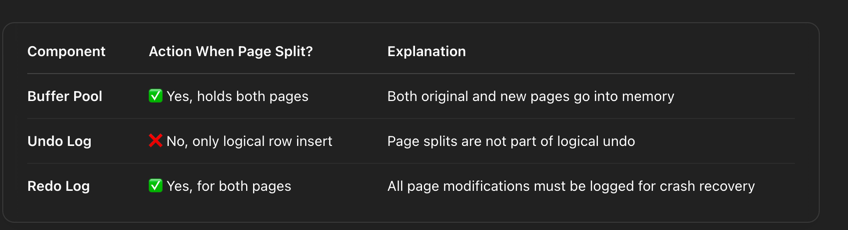

## Concepts

### Write Flow

```text
ha_innobase::write_row()
  └── row_insert_for_mysql()
      └── row_insert_for_mysql_using_ins_graph()
          └── row_ins_step()
              └── row_ins()
                  └── row_ins_index_entry_step()
                      └── row_ins_index_entry()
                          └── row_ins_clust_index_entry()
                              └── row_ins_clust_index_entry_low()....
```

```text
+---------------------------+
| ha_innobase::write_row()  |  <-- Entry point from MySQL Server layer
+---------------------------+
            |
            v
+----------------------------+
| row_insert_for_mysql()     |  <-- Prepares insert tuple, triggers row graph insert
+----------------------------+
            |
            v
+--------------------------------------+
| row_insert_for_mysql_using_ins_graph()| <-- Builds execution graph for insert ops
+--------------------------------------+
            |
            v
+------------------+
| row_ins_step()   |  <-- Executes one insert step (loop over graph)
+------------------+
            |
            v
+-------------+
| row_ins()   |  <-- Main insert function (calls for index insertions)
+-------------+
            |
            v
+-----------------------------+
| row_ins_index_entry_step()  |  <-- Handles insert per index
+-----------------------------+
            |
            v
+------------------------+
| row_ins_index_entry()  |  <-- Delegates to clustered or secondary insert
+------------------------+
            |
            v
+-------------------------------+
| row_ins_clust_index_entry()   |  <-- Clustered index insertion logic
+-------------------------------+
            |
            v
+----------------------------------+
| row_ins_clust_index_entry_low()  |  <-- Does actual B-tree insert
+----------------------------------+


                                                ↓
+-------------------------------------------------------------+
|                  InnoDB Storage Layer (B-Tree)              |
+-------------------------------------------------------------+
| row_ins_clust_index_entry_low()                             |
|   └── btr_cur_pessimistic_insert()  ←-- Lock, Search, Insert|
+-------------------------------------------------------------+
              ↓
+-------------------------------------------------------------+
|                Undo Log / Transaction Subsystem             |
+-------------------------------------------------------------+
| btr_cur_pessimistic_insert()                                |
|   └── trx_undo_report_row_operation() ←-- Log INSERT action |
|         └── trx_undo_add_page() ←-- Add page to undo segment|
+-------------------------------------------------------------+
              ↓
+-------------------------------------------------------------+
|                Tablespace & File Segment Mgmt              |
+-------------------------------------------------------------+
| trx_undo_add_page()                                        |
|   └── fseg_alloc_free_page_general() ←-- Alloc new page    |
|         └── fseg_inode_get() ←-- Get inode for fseg        |
+-------------------------------------------------------------+
              ↓
+-------------------------------------------------------------+
|                    Buffer Pool & Disk I/O                  |
+-------------------------------------------------------------+
| fseg_inode_get()                                           |
|   └── buf_page_get_gen() ←-- Load page into buffer pool    |
+-------------------------------------------------------------+
```

```c++
dberr_t row_ins_clust_index_entry_low(...) {
    mtr_t mtr;
    mtr.start();  // 🌱 Start mini-transaction

    // 1. Locate insert position in the BTree
    btr_pcur_t pcur;
    btr_cur_search_to_nth_level(..., &pcur, ...);

    // 2. Acquire necessary locks and generate UNDO log
    btr_cur_ins_lock_and_undo(flags, node, thr, entry, &pcur, &mtr);
    //    ↪️ Creates trx_undo_t entry and links to the record (roll_ptr)

    // 3. Insert the record into the page
    btr_cur_pessimistic_insert(flags, &pcur, entry, offsets, &rec, &mtr);
    //    ↪️ Page marked as dirty in Buffer Pool
    //    ↪️ Redo log written via mlog_write_ulint() etc.

    mtr.commit();  // ✅ Commit mini-transaction
    //    ↪️ Redo log flushed to redo log buffer (not disk yet)
    //    ↪️ Modified page stays in Buffer Pool
}


```

```c++
void btr_cur_search_to_nth_level(
    dict_index_t* index,             // in: target index structure
    ulint level,                     // in: desired tree level (usually 0 for leaf)
    const dtuple_t* tuple,           // in: tuple to search for (key or insert target)
    page_cur_mode_t mode,            // in: search mode (e.g., PAGE_CUR_LE)
    ulint latch_mode,                // in: latch mode for locking pages
    btr_cur_t* cursor,               // out: cursor positioned at the correct slot
    mtr_t* mtr) {                    // in: mini-transaction context

  ulint current_level = ULINT_UNDEFINED;  // Tracks current level during traversal
  page_t* page = nullptr;                 // Pointer to current page frame
  buf_block_t* block = nullptr;           // Buffer block for current page
  page_cur_t* page_cursor = btr_cur_get_page_cur(cursor); // Cursor for page-local search

  const space_id_t space = dict_index_get_space(index);     // Tablespace ID
  const page_size_t page_size(dict_table_page_size(index->table)); // Page size for index
  page_id_t page_id(space, dict_index_get_page(index));     // Start from root page

  current_level = dict_index_get_n_levels(index) - 1;        // Start at the root level

search_loop:
  // Step 1: Fetch and latch the current page in the tree
  block = btr_block_get(space, page_id.page_no(), latch_mode, mtr);
  page = buf_block_get_frame(block);

  // Step 2: Check if we've reached the desired level (e.g., leaf)
  if (current_level == level) {
    goto final_search;
  }

  // Step 3: Binary search to find the child pointer record in the current page
  page_cur_search_with_match(block, index, tuple, PAGE_CUR_LE, nullptr, nullptr, page_cursor);

  // Step 4: Extract the child page number from the located node pointer record
  const rec_t* rec = page_cur_get_rec(page_cursor);
  ulint child_page_no = btr_node_ptr_get_child_page_no(rec);

  // Step 5: Update the page ID to point to the child page and continue descent
  page_id.reset(space, child_page_no);
  current_level--;
  goto search_loop;

final_search:
  // Step 6: Final binary search in the leaf (or target) page using requested mode
  page_cur_search_with_match(block, index, tuple, mode,
                             &cursor->up_match, &cursor->low_match,
                             page_cursor);

  // Step 7: Populate the output cursor with final position and block reference
  cursor->block = block;
  cursor->index = index;
}

```



### Questions about Page split and things stored in MTR, Redo, Undo log.



### Questions about MVCC ang Page Split.


