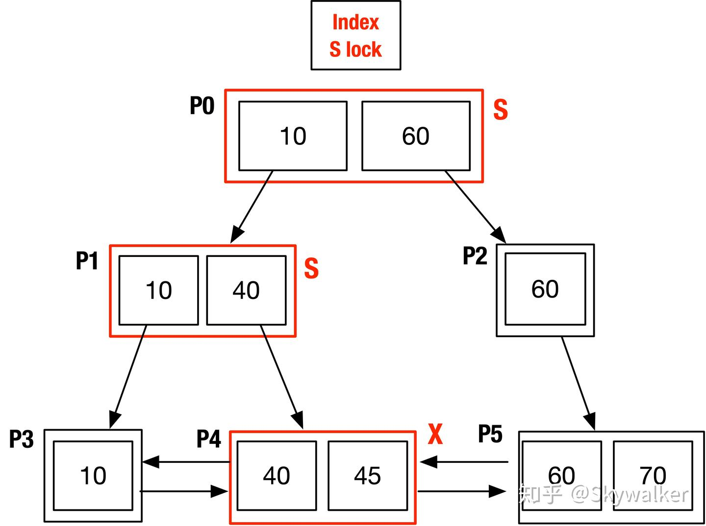

## Resources

### Todo
-  [ ] https://www.percona.com/blog/innodb-page-merging-and-page-splitting/
-  [ ] http://mysql.taobao.org/monthly/2019/10/01/
-  [ ] https://draven.co/whys-the-design-mysql-b-plus-tree/
-  [ ] https://zhuanlan.zhihu.com/p/164705538 [Important 1. Check reference list aswell]
-  [ ] https://zhuanlan.zhihu.com/p/164728032 [Important 1] 
-  [ ] https://www.zhihu.com/column/c_1271447104075182080 [Important]
-  [ ] https://www.jianshu.com/p/5248ca67eac2 [Important]
-  [ ] https://www.jianshu.com/p/0cdd573a8232


## Concepts

### File Layout


### BTree Lock


### Questions regarding Page Splitting

```text
💾 So the Answer to Your Core Doubt:
“What if the page split, and older transactions only saw the original page?”

They don’t just see the old page.

InnoDB uses cursor-based navigation: row_search_mvcc() can and will scan both original and split pages.

But it only returns records visible to that transaction, even if they are now in new pages.

InnoDB does not attempt to preserve the old physical page layout for older transactions — that would be too costly.


```


```text
      ┌──────────────────────┐
      │     B+Tree Index     │
      └────────┬─────────────┘
               │
         Root Page (internal)
               │
        ┌──────┴──────┐
        │             │
   Internal Page   Internal Page
        │             │
    ┌───┴───────┐ ┌────┴────────┐
    │ Leaf Page │ │ Leaf Page   │
    └────┬──────┘ └─────┬───────┘
         │              │
         ▼              ▼

      ┌─────────────────────────────────────────────┐
      │               Leaf Page (16KB)              │
      └─────────────────────────────────────────────┘
      | Page Header     (infimum + supremum)        |
      |---------------------------------------------|
      | Record 1: [id=100]                           |
      |   └── trx_id  = 101                          |
      |   └── roll_ptr --> Undo Log #0xA1234         |
      |---------------------------------------------|
      | Record 2: [id=101]                           |
      |   └── trx_id  = 105                          |
      |   └── roll_ptr --> Undo Log #0xA2234         |
      |---------------------------------------------|
      | Record 3: [id=102]                           |
      |   └── trx_id  = 109                          |
      |   └── roll_ptr --> Undo Log #0xA3234         |
      |---------------------------------------------|
      | Supremum record                              |
      └─────────────────────────────────────────────┘

                 ▼
     ┌───────────────────────────┐
     │ Undo Log Segment (Rollback)│
     └───────────────────────────┘
     | Entry at 0xA1234:          |
     |   trx_id = 101             |
     |   old values: id=99        |
     |---------------------------|
     | Entry at 0xA2234:          |
     |   trx_id = 105             |
     |   old values: id=100       |
     |---------------------------|
     | Entry at 0xA3234:          |
     |   trx_id = 109             |
     |   old values: id=101       |
     └───────────────────────────┘

```


```text
┌────────────────────────────────────────────────────────────┐
│ Page (Leaf, FIL_PAGE_INDEX, Level = 0)                     │
└────────────────────────────────────────────────────────────┘
│ File Header (FIL_PAGE_TYPE = 0x45BF)                       │
├────────────────────────────────────────────────────────────┤
│ Page Header (PAGE_LEVEL = 0, PAGE_INDEX_ID, etc.)          │
├────────────────────────────────────────────────────────────┤
│ User Record 1: rec_t                                       │
│ ┌────────────────────────────────────────────────────────┐ │
│ │ Record Header (5–6 bytes):                             │ │
│ │   └─ n_fields, delete_flag, next_record_offset         │ │
│ ├────────────────────────────────────────────────────────┤ │
│ │ Field 1: id = 101 (INT, 4 bytes)                       │ │
│ ├────────────────────────────────────────────────────────┤ │
│ │ Field 2: name = "Bob"                                  │ │
│ │   └─ If VARCHAR(255), length encoded in 1 byte         │ │
│ │   └─ Stored inline: 0x03 'B' 'o' 'b'                    │ │
│ ├────────────────────────────────────────────────────────┤ │
│ │ System Field:                                          │ │
│ │   └─ trx_id = 105                                      │ │
│ │   └─ roll_ptr = 0xA2234                                │ │
│ └────────────────────────────────────────────────────────┘ │
├────────────────────────────────────────────────────────────┤
│ User Record 2: rec_t                                       │
│ ┌────────────────────────────────────────────────────────┐ │
│ │ id = 102                                                │ │
│ │ name = VARCHAR(5000)                                    │ │
│ │   └─ Stored externally (overflowed)                     │ │
│ │   └─ value = {extern bit set, pointer to overflow page} │ │
│ │ trx_id, roll_ptr                                        │ │
│ └────────────────────────────────────────────────────────┘ │
├────────────────────────────────────────────────────────────┤
│ Page Directory (offsets to records)                        │
└────────────────────────────────────────────────────────────┘

   ▼

┌──────────────────────────────────────────────┐
│ External Overflow Page (TEXT/BLOB Storage)   │
└──────────────────────────────────────────────┘
│ FIL_PAGE_TYPE = FIL_PAGE_BLOB                │
│ Content:                                     │
│   └─ "This is a long VARCHAR..."             │
│   └─ Possibly multiple pages chained         │
└──────────────────────────────────────────────┘

```


### BTree Page


### BTree Write




```text
Ref: https://www.jianshu.com/p/5248ca67eac2


Sql_cmd_insert::mysql_insert
 >Sql_cmd_insert::mysql_insert
    >切换session状态为 update
    >进入插入逻辑
    >handler::ha_write_row
     >ha_innobase::write_row
      >row_insert_for_mysql
            >row_insert_for_mysql_using_ins_graph 
             >trx_start_if_not_started_xa_low 
               >trx_start_low                                       激活事物，事物状态由 not_active 变为 active
             >row_ins_step
               >row_ins
                >row_ins_index_entry_step
                 >row_ins_index_entry
                  >row_ins_clust_index_entry
                            >row_ins_clust_index_entry_low 
                              >btr_cur_search_to_nth_level                   查找定位数据
                               >btr_cur_optimistic_insert                    进行乐观插入
                                 >btr_cur_ins_lock_and_undo 
                                  >trx_undo_report_row_operation 
                                    >trx_undo_page_report_insert               记录insert的undo记录
                                     >trx_undo_page_set_next_prev_and_add
                                      >trx_undof_page_add_undo_rec_log         记录undo的redo log 入redo buffer
                                 >page_cur_tuple_insert                      进行insert 元组插入，及实际的插入操作
                                  >page_cur_insert_rec_write_log             记录插入的redo log 入redo buffer                  
       >binlog_log_row    
        >write_locked_table_maps 
         >THD::binlog_write_table_map
          >binlog_start_trans_and_stmt
           >binlog_cache_data::write_event                        binlog event 写入到 binlog cache 
```