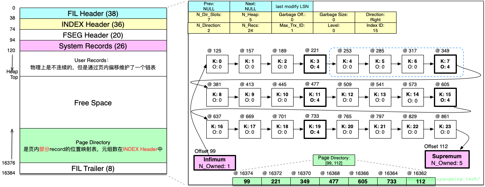
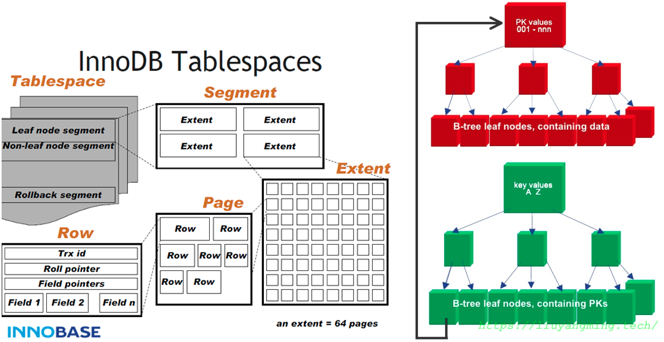
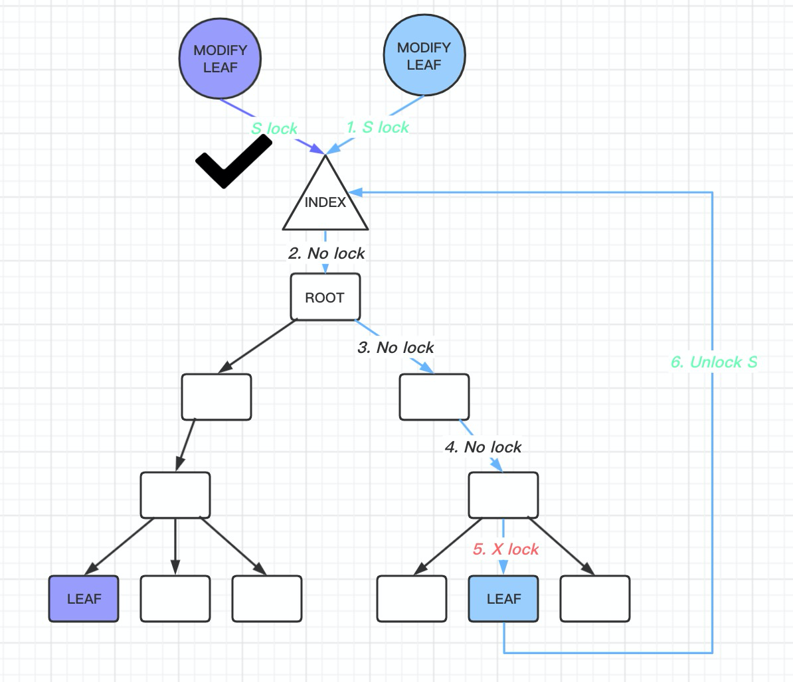
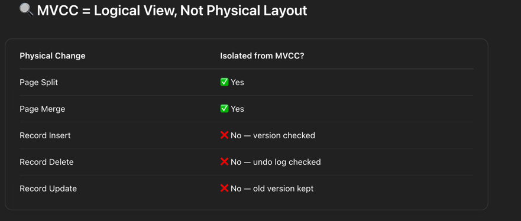
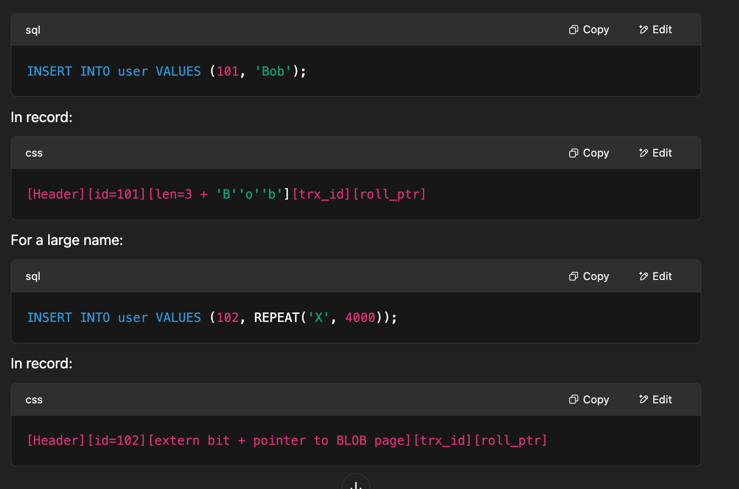
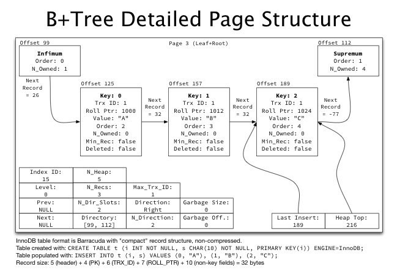

## Resources

### Todo
-  [ ] https://www.percona.com/blog/innodb-page-merging-and-page-splitting/
-  [ ] http://mysql.taobao.org/monthly/2019/10/01/
- 

## Concepts

### File Layout






### BTree Lock



### Questions regarding Page Splitting

```text
💾 So the Answer to Your Core Doubt:
“What if the page split, and older transactions only saw the original page?”

They don’t just see the old page.

InnoDB uses cursor-based navigation: row_search_mvcc() can and will scan both original and split pages.

But it only returns records visible to that transaction, even if they are now in new pages.

InnoDB does not attempt to preserve the old physical page layout for older transactions — that would be too costly.


```




```text
      ┌──────────────────────┐
      │     B+Tree Index     │
      └────────┬─────────────┘
               │
         Root Page (internal)
               │
        ┌──────┴──────┐
        │             │
   Internal Page   Internal Page
        │             │
    ┌───┴───────┐ ┌────┴────────┐
    │ Leaf Page │ │ Leaf Page   │
    └────┬──────┘ └─────┬───────┘
         │              │
         ▼              ▼

      ┌─────────────────────────────────────────────┐
      │               Leaf Page (16KB)              │
      └─────────────────────────────────────────────┘
      | Page Header     (infimum + supremum)        |
      |---------------------------------------------|
      | Record 1: [id=100]                           |
      |   └── trx_id  = 101                          |
      |   └── roll_ptr --> Undo Log #0xA1234         |
      |---------------------------------------------|
      | Record 2: [id=101]                           |
      |   └── trx_id  = 105                          |
      |   └── roll_ptr --> Undo Log #0xA2234         |
      |---------------------------------------------|
      | Record 3: [id=102]                           |
      |   └── trx_id  = 109                          |
      |   └── roll_ptr --> Undo Log #0xA3234         |
      |---------------------------------------------|
      | Supremum record                              |
      └─────────────────────────────────────────────┘

                 ▼
     ┌───────────────────────────┐
     │ Undo Log Segment (Rollback)│
     └───────────────────────────┘
     | Entry at 0xA1234:          |
     |   trx_id = 101             |
     |   old values: id=99        |
     |---------------------------|
     | Entry at 0xA2234:          |
     |   trx_id = 105             |
     |   old values: id=100       |
     |---------------------------|
     | Entry at 0xA3234:          |
     |   trx_id = 109             |
     |   old values: id=101       |
     └───────────────────────────┘

```


```text
┌────────────────────────────────────────────────────────────┐
│ Page (Leaf, FIL_PAGE_INDEX, Level = 0)                     │
└────────────────────────────────────────────────────────────┘
│ File Header (FIL_PAGE_TYPE = 0x45BF)                       │
├────────────────────────────────────────────────────────────┤
│ Page Header (PAGE_LEVEL = 0, PAGE_INDEX_ID, etc.)          │
├────────────────────────────────────────────────────────────┤
│ User Record 1: rec_t                                       │
│ ┌────────────────────────────────────────────────────────┐ │
│ │ Record Header (5–6 bytes):                             │ │
│ │   └─ n_fields, delete_flag, next_record_offset         │ │
│ ├────────────────────────────────────────────────────────┤ │
│ │ Field 1: id = 101 (INT, 4 bytes)                       │ │
│ ├────────────────────────────────────────────────────────┤ │
│ │ Field 2: name = "Bob"                                  │ │
│ │   └─ If VARCHAR(255), length encoded in 1 byte         │ │
│ │   └─ Stored inline: 0x03 'B' 'o' 'b'                    │ │
│ ├────────────────────────────────────────────────────────┤ │
│ │ System Field:                                          │ │
│ │   └─ trx_id = 105                                      │ │
│ │   └─ roll_ptr = 0xA2234                                │ │
│ └────────────────────────────────────────────────────────┘ │
├────────────────────────────────────────────────────────────┤
│ User Record 2: rec_t                                       │
│ ┌────────────────────────────────────────────────────────┐ │
│ │ id = 102                                                │ │
│ │ name = VARCHAR(5000)                                    │ │
│ │   └─ Stored externally (overflowed)                     │ │
│ │   └─ value = {extern bit set, pointer to overflow page} │ │
│ │ trx_id, roll_ptr                                        │ │
│ └────────────────────────────────────────────────────────┘ │
├────────────────────────────────────────────────────────────┤
│ Page Directory (offsets to records)                        │
└────────────────────────────────────────────────────────────┘

   ▼

┌──────────────────────────────────────────────┐
│ External Overflow Page (TEXT/BLOB Storage)   │
└──────────────────────────────────────────────┘
│ FIL_PAGE_TYPE = FIL_PAGE_BLOB                │
│ Content:                                     │
│   └─ "This is a long VARCHAR..."             │
│   └─ Possibly multiple pages chained         │
└──────────────────────────────────────────────┘

```



### BTree Page

