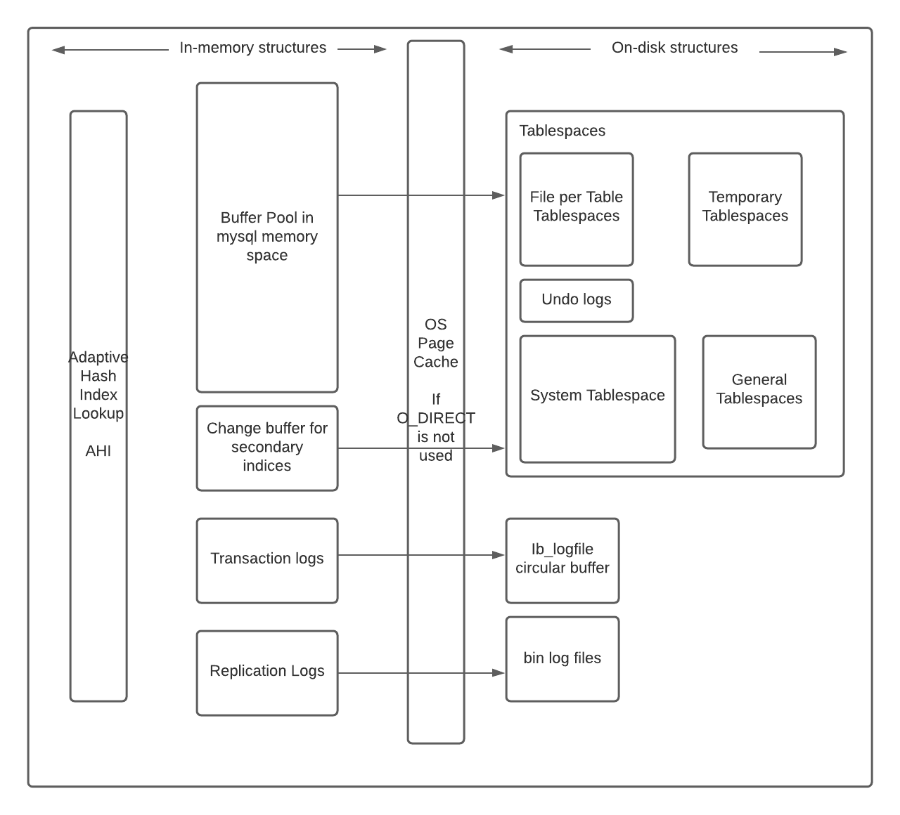
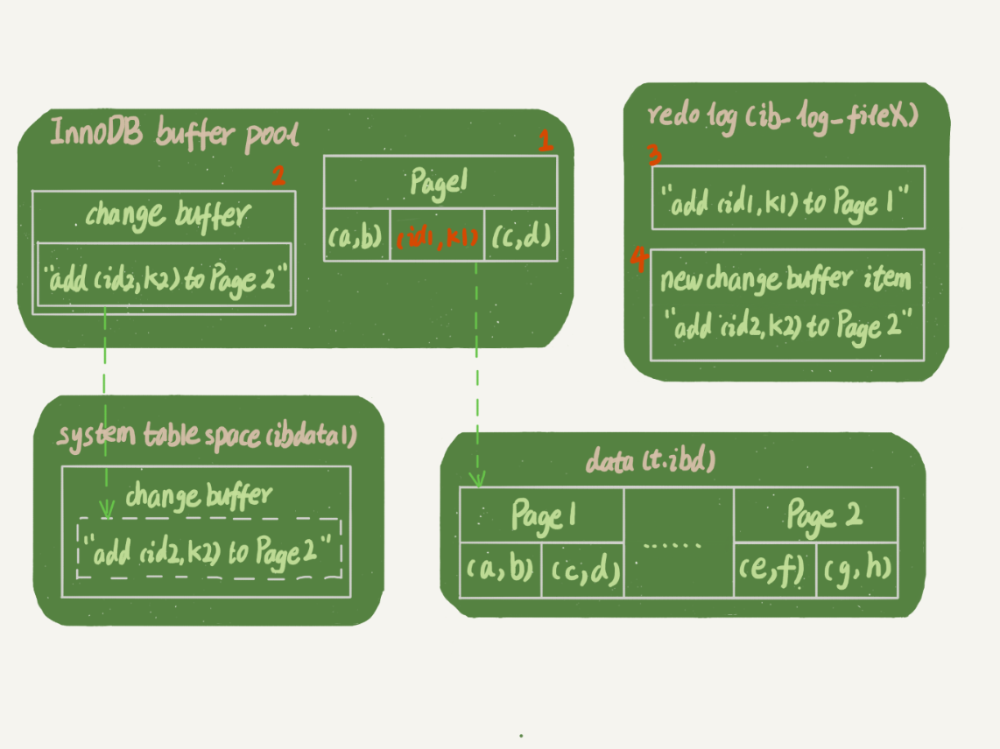
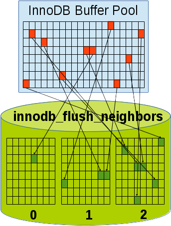
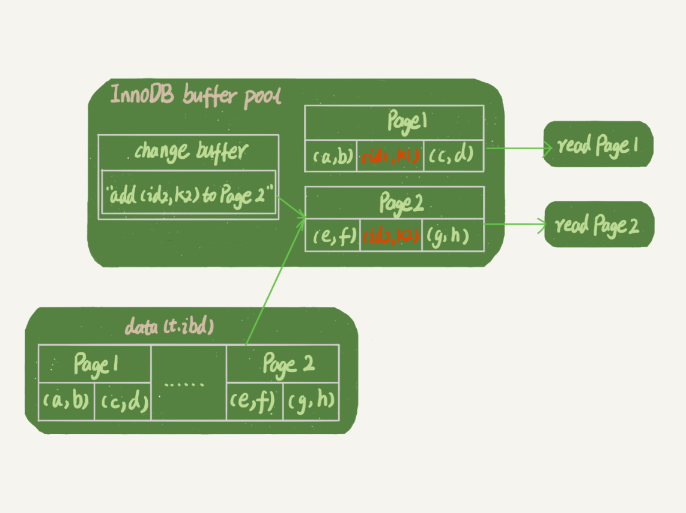
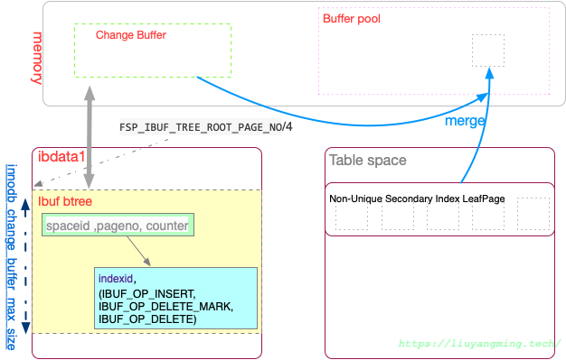

## Resources

### Todo
- [ ] https://www.cnblogs.com/Benjious/p/12341138.html
- [ ] https://zhuanlan.zhihu.com/p/512706314

## Concepts

### Change Buffer (for Secondary Indexes)

### If Change Buffer was not there

### Change Buffer used in Read Path 

### IBuf in File

