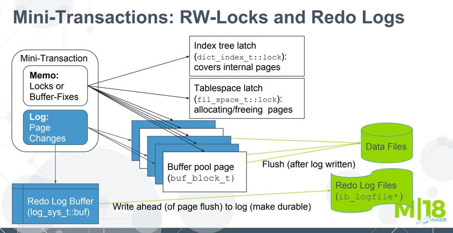
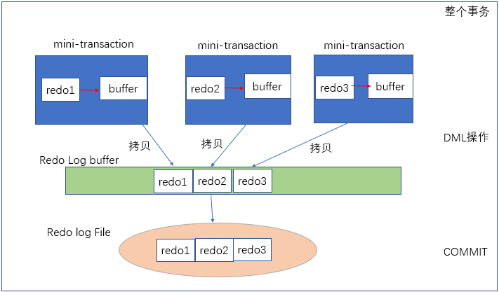

## Concepts

### Mini Transaction

### Lifecycle of a Mini Transaction

- Navigate the btree, x-latch the page along the way, and push in mtr memo.
- Lock manager lock the user records involved
- write undo log in a separate mtr
- modify the page in the buffer pool
- generate redo log that store in mtr_log
- mtr_commit- send redo log to the log buffer, and release the pages and index latches

MTR is a low level building block used on all the page accesses and modification, including
- undo log
  1. find a free undo slot
  2. reserve free extents
  3. create a new fseg
  4. release free extents
  5. init undo log segment
  6. set undo slot for this rseg
  7. create a new undo log header in this undo log segment
- file space management (page allocation and deletion)
- dictionary
- transaction system page
- BTree structure modification(split or merge) while allocating a new page or freeing a page
- Insert update of BLOB which involves multiple pages