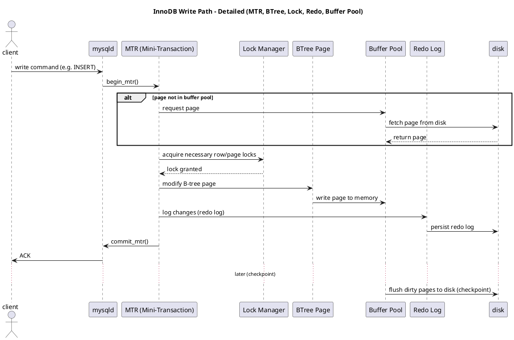
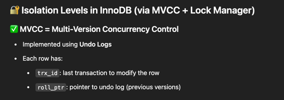
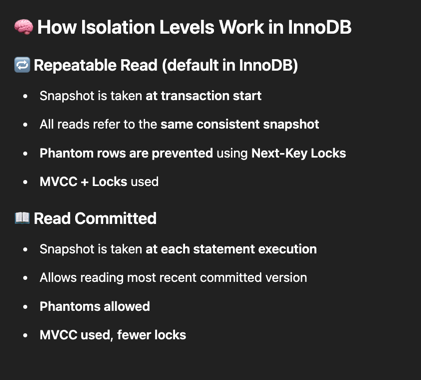
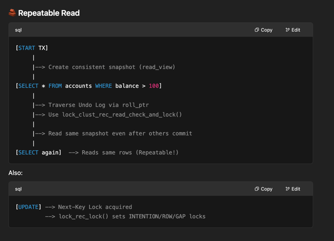
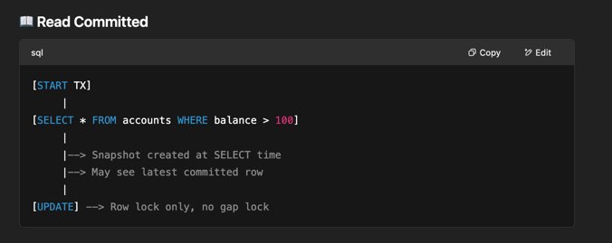
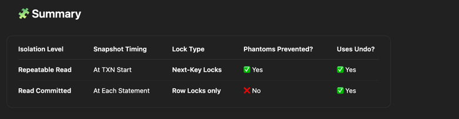
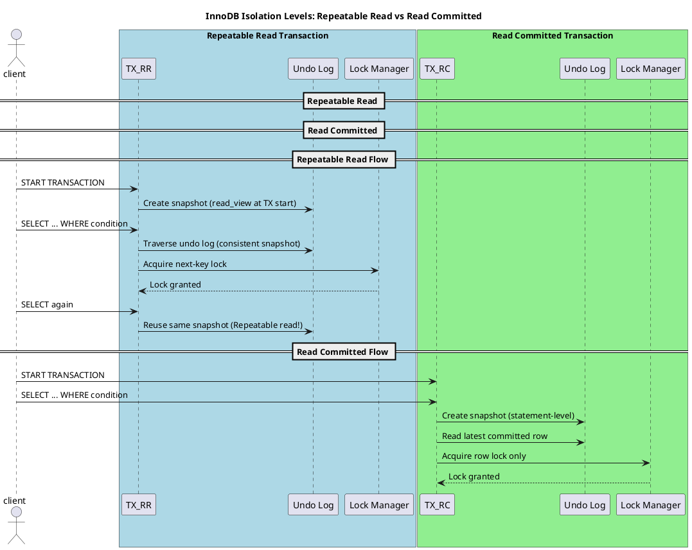
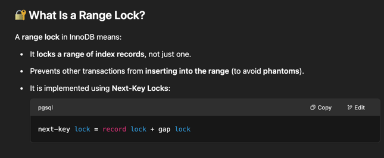
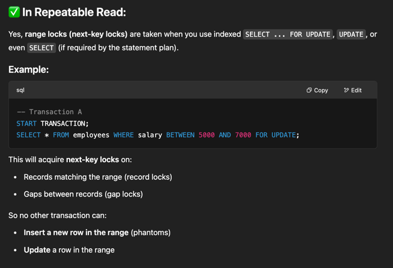

## Concepts

### Locking



### Isolation Levels







> This is when `innodb_lock_timeout` comes into picture












> No wonder why `SELECT ... FOR UPDATE;` timed out.

```text
[5]----[10]----[15]----[20]----[25]
   ^                 ^
   Range: 10 to 20
   Locks:
     - Record lock on [10], [15], [20]
     - Gap locks: before 10, between 10–15, 15–20

  Prevents inserts at: 7, 12, 18

```
