## Resources

### Done

- [x] Page Fix/Unfix, LRU List, Free List, and Flush List, Batch Flush, Lock Order (LRU list → hash map → block mutex → frame lock) [Alibaba](https://www.alibabacloud.com/blog/an-in-depth-analysis-of-buffer-pool-in-innodb_601216?spm=a2c65.11461447.0.0.7748441aH4tpmJ)
- [x] How Chunk, Block and Page are allocated https://genexdbs.com/how-to-verify-the-innodb-buffer-distribution/
- [x] Basics https://dev.mysql.com/doc/refman/8.0/en/innodb-buffer-pool.html
- [x] Code Flow https://www.leviathan.vip/2018/12/18/InnoDB%E7%9A%84BufferPool%E5%88%86%E6%9E%90/
- [x] All full forms , Buddy Memory Management https://juejin.cn/post/6844903507414220814

### To Do

- [ ] Read/Write Path https://docs.netapp.com/us-en/ontap-apps-dbs/mysql/mysql-file-structure.html
- [ ] Buffer pool concurrency control https://baotiao.github.io/2020/04/13/innodb-bp-coucurrency.html
- [ ] https://hidetatz.medium.com/how-innodb-writes-data-on-the-disk-1b109a8a8d14
- [ ] https://deepakmysqldba.wordpress.com/2021/05/09/innodb-mysql-8-architecture/
- [ ] Page Flushing https://hackmysql.com/book-6/
- [ ] Flushing https://lefred.be/content/a-graph-a-day-keeps-the-doctor-away-mysql-checkpoint-age/
- [ ] Flushing https://www.percona.com/blog/innodb-flushing-in-action-for-percona-server-for-mysql/
- [ ] Memory Allocation https://www.alibabacloud.com/blog/mysql-memory-allocation-and-management-part-ii_600992
- [ ] On Disk Files https://medium.com/@nuwanwe/innodb-system-tablespace-a-comprehensive-overview-and-best-practices-f96ee6dd39ab
- [ ] MySQL architecture https://www.mysqltutorial.org/mysql-administration/mysql-innodb-architecture/
- [ ] https://cloud.tencent.com/developer/article/1885295
- [ ] https://www.sobyte.net/post/2022-08/mysql-innodb/

## Concepts

### Query Execution Flow

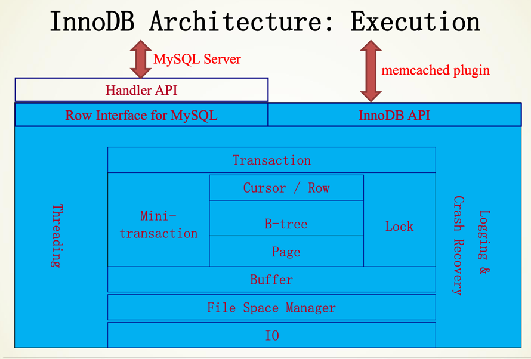

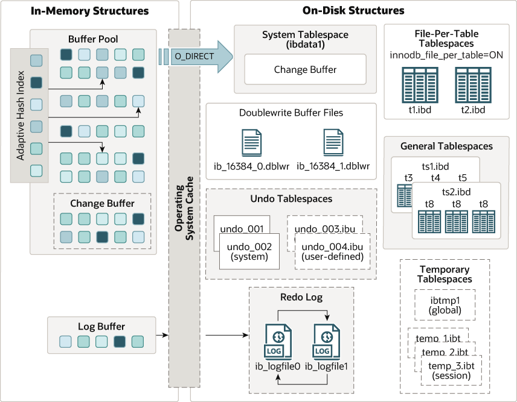

### Read/Write Path

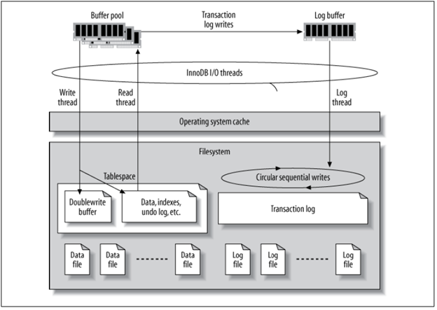

### Chunk, Block, Page 

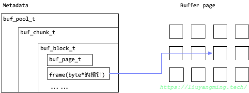

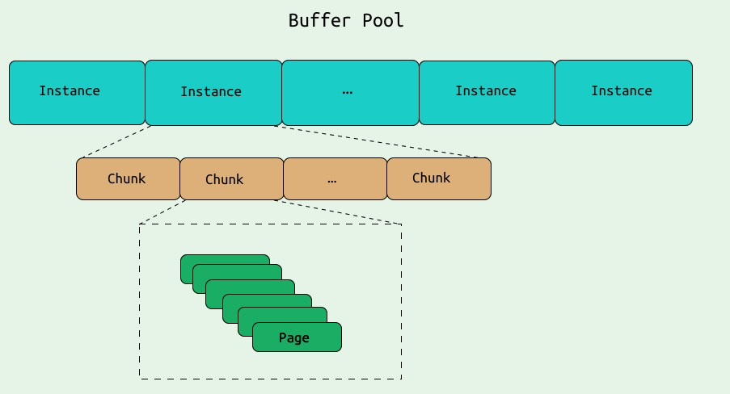

### Buffer Pool Structure

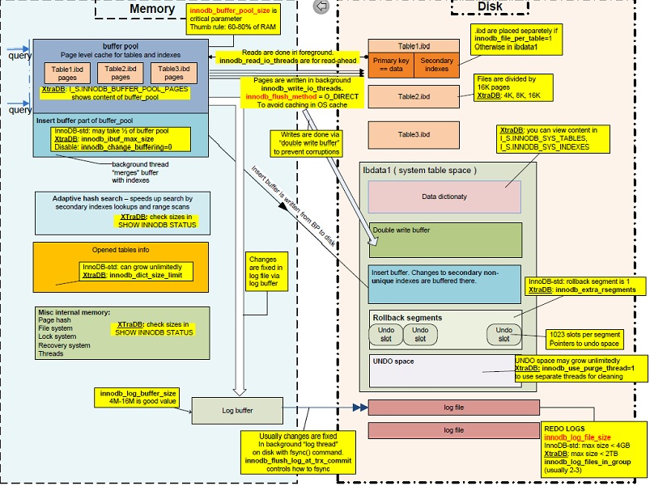

### LRU

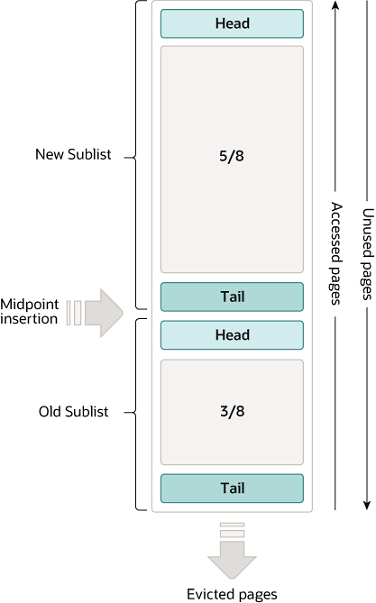

### Buddy Memory Management
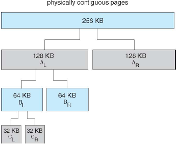

### Flushing / Checkpointing
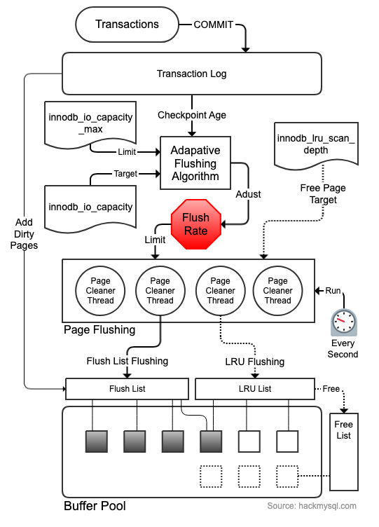

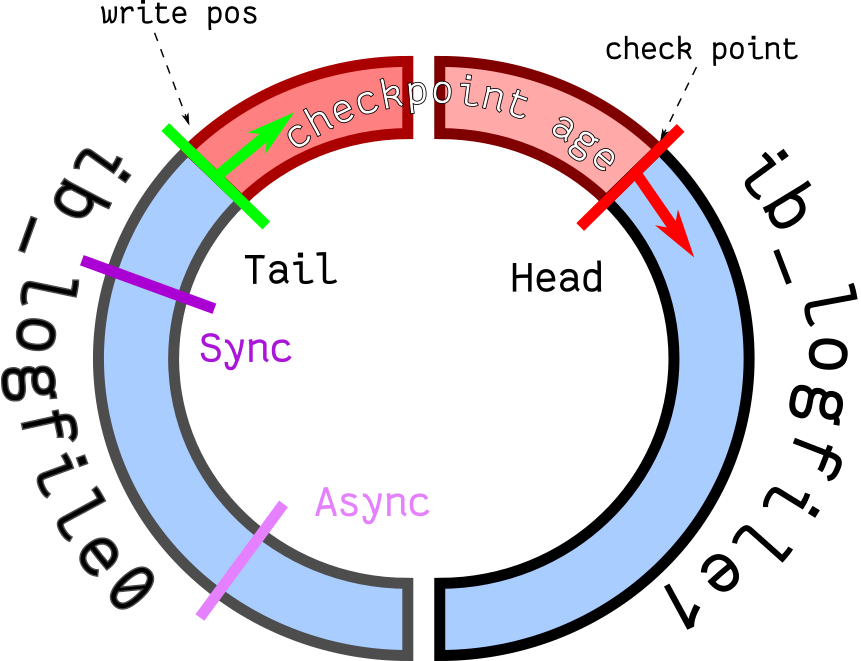

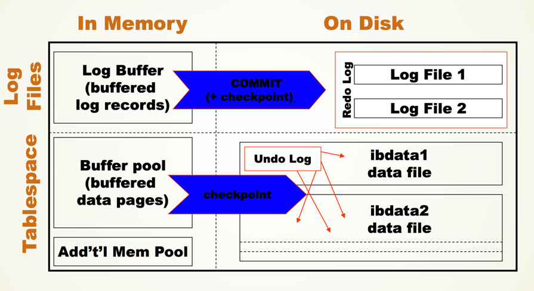

### Adapting Hash Index

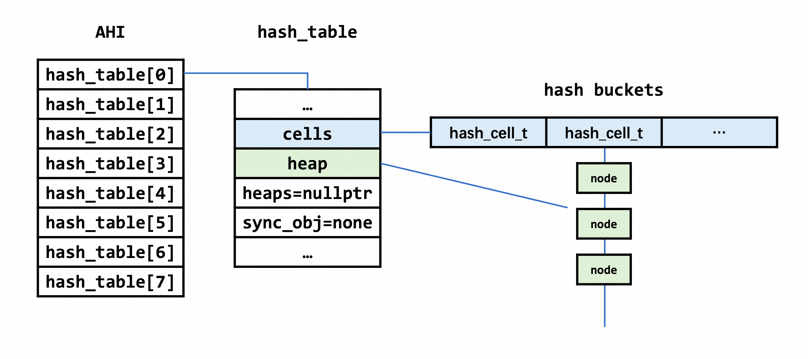

### Concurrency Control

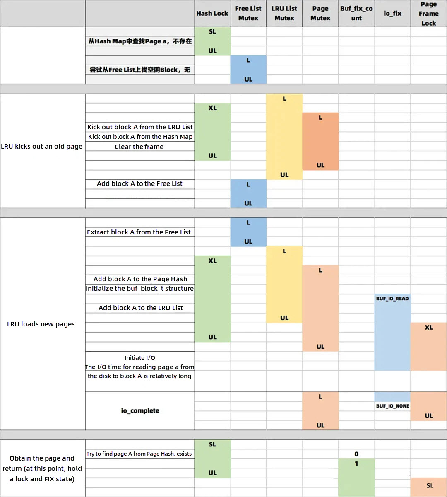

### On Disk Files

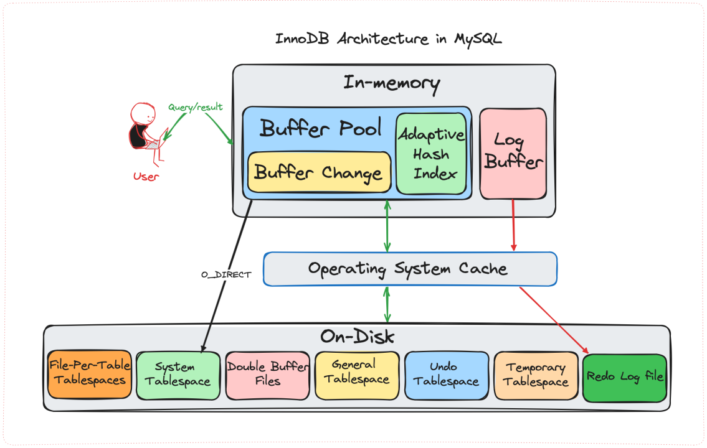
