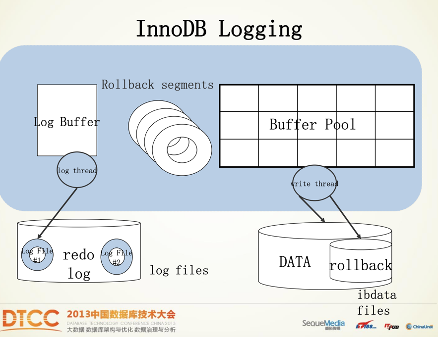
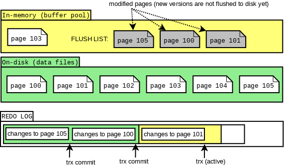
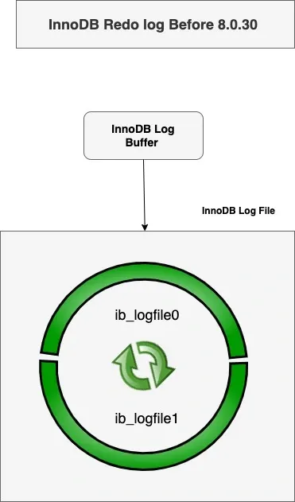
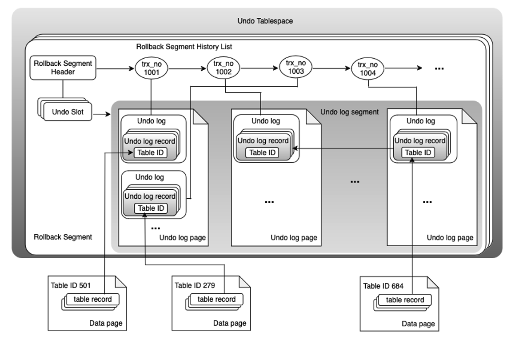

## Resources

### Todo
- [ ] https://blog.stackademic.com/mysql-innodb-redo-log-illustrated-explanation-de5904c680ef
]

## Concepts

### Redo Log - ARIES

### Data in File

### Redo Log Buffer

### Rollback Segment History List

