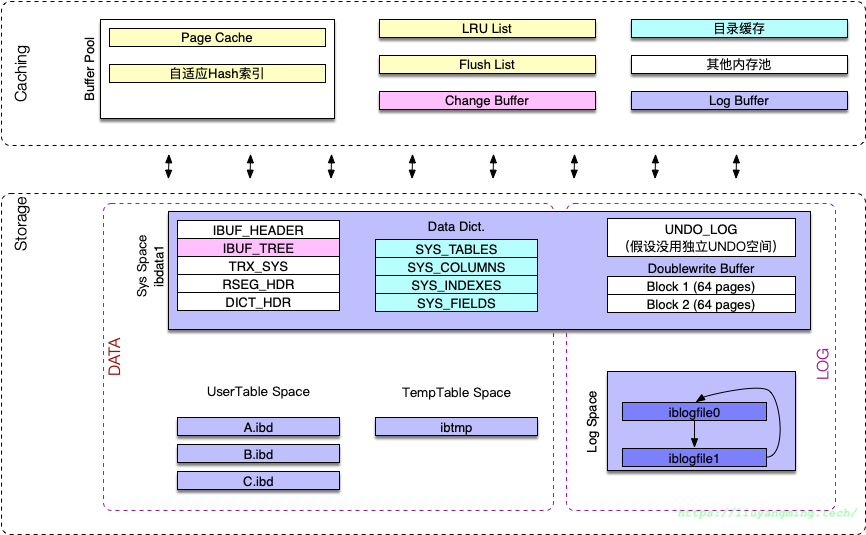
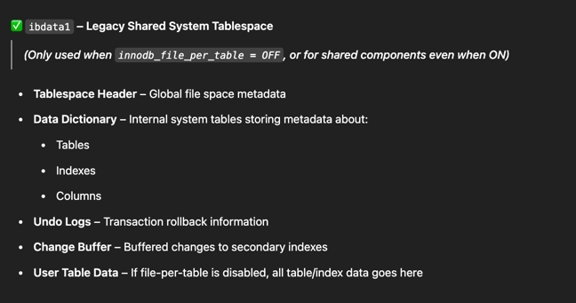
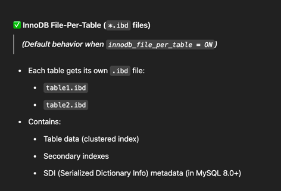
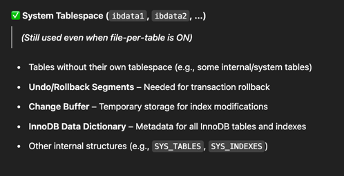
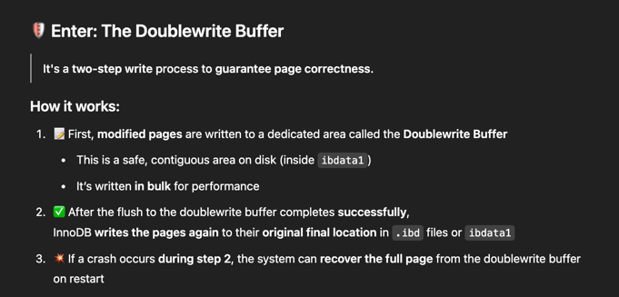
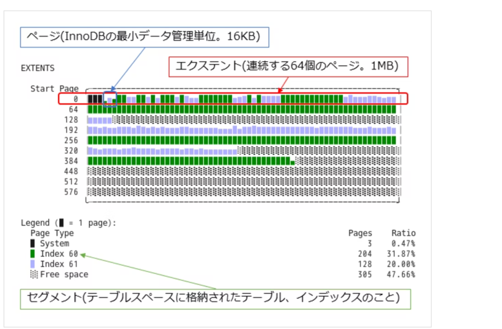
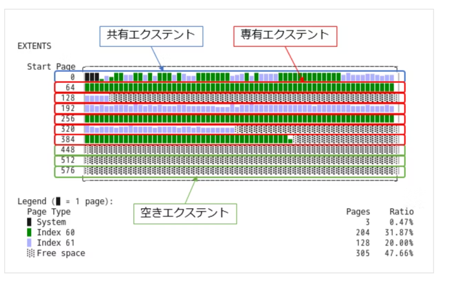

## TODO
- [ ] InnoDB File Layout visualizer: https://blog.jcole.us/2014/10/02/visualizing-the-impact-of-ordered-vs-random-index-insertion-in-innodb/
- [ ] https://qiita.com/SH2/items/654d89759e7e39d999b5


## Concepts

### File Layout of InnoDB



### Files








### Double Write Buffer



Key Ideas
- First write is in contiguous area on disk (inside ibdata1)

```text
[ibdata1] System Tablespace
┌─────────────────────────────┐
│ Doublewrite Buffer (2MB)    │
│ ┌─────────────────────────┐ │
│ │ Block 0 → 64 pages      │ │
│ │ Block 1 → 64 pages      │ │
│ └─────────────────────────┘ │
└─────────────────────────────┘

[.ibd file]
┌────────────┐
│ Final Page │ ← second write goes here
└────────────┘

```


```text
[Buffer Pool]
    ↓ (flush modified page)
[Doublewrite Buffer (memory)]
    ↓
[Disk: Doublewrite Area in ibdata1]
    ↓ (flush again)
[Disk: Final destination page in .ibd file]

```


### File Layout Tool




